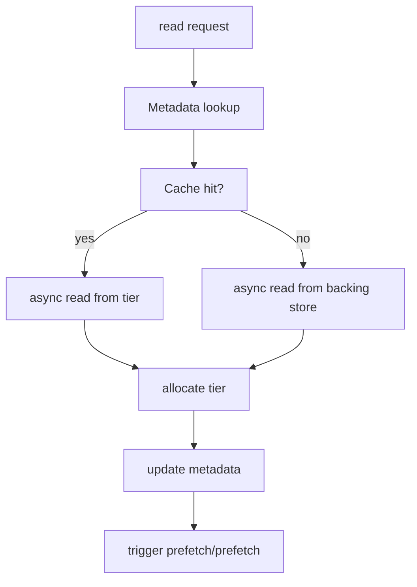
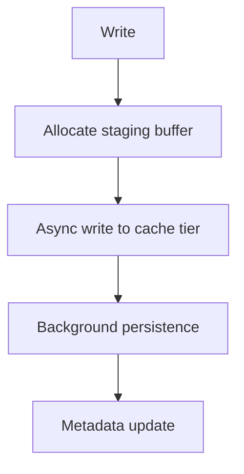

# HANS Architecture

This document describes the high-level architecture of HANS — Hardware-Aware
Neural Storage — and the responsibilities of its core components.

---

## Architectural Overview

HANS is a distributed, cache-first storage system that sits between AI compute
workloads and persistent storage backends.

It is designed around a simple idea:

> Move intelligence into the cache layer, where hardware context and workload
> behavior are visible and actionable.

At a high level:
 ```mermaid
graph TD
    subgraph AI ["**_AI Frameworks & Applications_**"]
        direction LR
        PT[PyTorch] --- TF[TensorFlow] --- TR[Triton] --- FS[Feature Stores]
    end

    subgraph Clients ["**_Client Interfaces_**"]
        direction LR
        POSIX[POSIX / FUSE] --- PY[Python API] --- NA[Native] --- S3[S3]
    end

    subgraph Core ["**Core Cache Engine (THIS DESIGN)**"]
        direction LR
        PL[[Placement]] --- PR[[Prefetch]] --- CH[[Chunking]] --- EV[[Eviction]] --- IO[[I/O]] ---  GPU[[GPU-aware]] --- FA[[Format-aware]]
    end

    subgraph Storage ["**_Storage Tiers & Backends_**"]
        direction LR
        RAM[(RAM)] --- NVMe[(NVMe)] ---  DISK[(SSD)] --- OBJ[(Object Store)] --- RFS[(Remote FS)]
    end

    AI --> Clients
    Clients --> Core
    Core --> Storage
```

---

## Core Components

### 1. CacheManager

The `CacheManager` is the central coordinator of the HANS data plane.

Responsibilities:
- Orchestrates read and write requests
- Coordinates metadata, tier allocation, and I/O
- Delegates decisions to policy engines
- Maintains minimal logic to avoid bottlenecks

The CacheManager does not perform heavy I/O itself.

---

### 2. MetadataStore

The `MetadataStore` tracks:

- File-to-chunk mappings
- Chunk locations across tiers
- Access frequency and recency
- Job and workload associations

Metadata is optimized for fast lookups and updates, not durability.
Persistent metadata is optional and secondary.

---

### 3. TierManager

The `TierManager` abstracts physical storage tiers:

- Unpinned RAM
- Pinned (page-locked) host RAM
- NVMe / local disk
- Ephemeral VRAM (optional, best-effort)

Responsibilities:
- Allocate and free memory in specific tiers
- Track capacity and pressure
- Enforce tier-specific constraints (e.g., VRAM limits)

VRAM is treated as a transient staging area, not a durable cache.

---

### 4. IOEngine

The `IOEngine` is responsible for all data movement.

Key characteristics:
- Asynchronous and non-blocking
- Built on modern Linux primitives (io_uring)
- Supports batching and zero-copy where possible
- Provides POSIX fallback paths when required

The IOEngine is a critical performance differentiator.

---

### 5. PlacementEngine

The `PlacementEngine` decides where data should live.

Inputs include:
- GPU locality and utilization
- Job priority and ownership
- Access patterns
- Current tier pressure

Placement decisions are dynamic and revisited continuously.

---

### 6. PrefetchEngine

The `PrefetchEngine` predicts future data access and preloads data into
appropriate tiers.

Capabilities:
- Sequential and strided access detection
- Epoch-based training pattern recognition
- Priority-aware prefetch scheduling

Prefetching is adaptive and workload-specific.

---

### 7. EvictionEngine

The `EvictionEngine` selects cache victims when resources are constrained.

Eviction decisions consider:
- Job importance
- GPU usage
- Data reuse likelihood
- Checkpoint pinning
- Tier-specific costs

Simple LRU is insufficient for AI workloads.

---

### 8. TelemetryEngine

The `TelemetryEngine` provides observability and feedback.

Sources include:
- eBPF kernel probes
- GPU utilization and memory metrics
- I/O latency and throughput

Telemetry feeds directly into placement, prefetch, and eviction decisions.

---

## Read Path (Simplified)



---

## Write Path (Checkpoint-Oriented)



Writes are optimized for throughput and minimal GPU disruption.

---

## Edge vs Datacenter Profiles

HANS supports explicit deployment profiles:

### Edge Profile
- Smaller chunk sizes
- Aggressive VRAM avoidance
- Power- and memory-aware policies
- Reduced background activity

### Datacenter Profile
- Larger chunks
- Deeper prefetch pipelines
- Higher concurrency
- Aggressive RAM and NVMe utilization

Profiles affect policy behavior, not core architecture.

---

## Design Trade-offs

HANS intentionally prioritizes:
- Performance over universality
- Observability over simplicity
- Hardware awareness over abstraction purity

These trade-offs are essential to meet the needs of AI workloads.

---

## Future Extensions

- ML-driven cache policies
- GPUDirect Storage integration
- Cross-node cooperative caching
- Format-aware tensor slicing
- Advanced checkpoint orchestration

These are additive and do not change the core design.

---

HANS is designed to evolve with hardware and workloads, while maintaining a
clear and focused architectural core.
